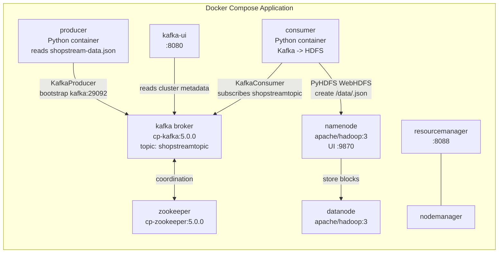
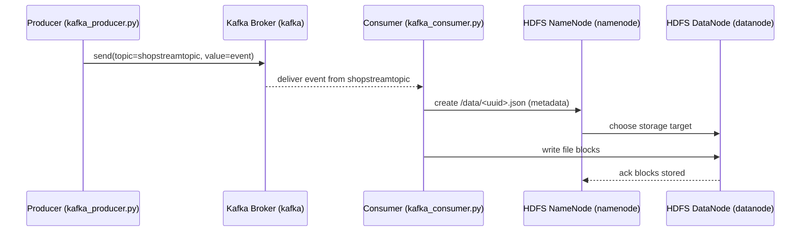

# Project summary

## What this project is
This repository is a **mini data engineering pipeline** built for learning:

- A **Kafka Producer** reads a real dataset (`docker/producer/shopstream-data.json`) and publishes events to a Kafka topic.
- A **Kafka Consumer** subscribes to that topic and writes each event as a JSON file into **HDFS**.
- Everything runs as **containers** orchestrated with **Docker Compose**.

## Objective
By the end of this project, students should be able to:

- Explain the role of **Docker**, **Docker Compose**, and **Docker Hub** in a multi-service data project.
- Explain how **Kafka** transports events (producer → broker → topic → consumer).
- Explain how **Hadoop HDFS** stores data (NameNode metadata + DataNode blocks).
- Follow the concrete end-to-end journey of one event from a JSON line to a file in HDFS.

## Why Docker, Kafka, and Hadoop are used here
- **Docker**: makes the stack reproducible (same Kafka/Hadoop/Python versions on every machine).
- **Kafka**: acts as an event backbone to transport data continuously and decouple producer/consumer.
- **Hadoop (HDFS)**: stores ingested events in a distributed storage system designed for big data.

## Data flow (high-level)
- The dataset is **newline-delimited JSON** (one event per line), for example:

```json
{"event": "ProductView", "messageid": "...", "userid": "user-78", "properties": {"productid": "product-173"}, "context": {"source": "desktop"}}
```

- Flow:

- **Producer** reads `shopstream-data.json`
- **Kafka** receives and stores messages in topic `shopstreamtopic`
- **Consumer** reads messages from topic `shopstreamtopic`
- **Consumer** writes each message to **HDFS** at `/data/<uuid>.json`

---

# Complete lesson

## 1) General introduction to the project

### 1.1 Simple presentation
This project is a small-scale version of a common real-world pattern:

- **Events** are produced continuously (e.g., user actions in an e-commerce website).
- Events are transported through a **message broker** (Kafka).
- Events are ingested and stored in a **data lake storage** (HDFS).

### 1.2 Main components in this repository
From `docker-compose.yml`, the core services are:

- **Kafka stack**
  - `zookeeper` (coordination service required by this Kafka version)
  - `kafka` (the broker)
  - `kafka-ui` (web UI to inspect topics and messages)
- **Hadoop/HDFS + YARN stack** (from `apache/hadoop:3` image)
  - `namenode` (HDFS metadata)
  - `datanode` (HDFS data blocks)
  - `resourcemanager`, `nodemanager` (YARN, included for completeness)
- **Custom Python apps**
  - `producer` (builds from `docker/producer/Dockerfile`)
  - `consumer` (builds from `docker/consumer/Dockerfile`)

### 1.3 Why these tools fit together
- **Kafka** is great for *transport* and buffering (it can handle bursts and keep data until consumers read it).
- **HDFS** is great for *storage* (distributed, scalable, designed for large files and later analytics).
- **Docker Compose** is the simplest way to start all these services locally as a realistic “mini platform”.

### 1.4 Project story: “from a click to storage”
Imagine a user views a product. That action becomes an event:

- **Producer** publishes a `ProductView` event to Kafka.
- **Kafka** stores it in topic `shopstreamtopic`.
- **Consumer** reads it and stores it as a JSON file in HDFS.

---

## 2) Teaching section on Docker (with project examples)

### 2.1 What Docker is (simple definition)
**Docker** is a technology that packages an application and everything it needs (runtime, libraries, configuration) into a **container**.

#### Pedagogical analogy
- **Image** = a “recipe + ingredients list” (a blueprint).
- **Container** = the “cooked dish on your plate” (a running instance).

### 2.2 Image vs container
- **Docker image**:
  - Immutable template.
  - Example in this project: `python:3.7`, `confluentinc/cp-kafka:5.0.0`, `apache/hadoop:3`.
- **Docker container**:
  - A running (or stopped) instance of an image.
  - Example: a running Kafka broker container created from `confluentinc/cp-kafka:5.0.0`.

### 2.3 Why Docker is used
Without Docker, students would have to install:

- Kafka + Zookeeper
- Hadoop HDFS (NameNode/DataNode)
- Python dependencies

…and solve OS-specific issues.

With Docker, the project becomes:

- one configuration file (`docker-compose.yml`)
- one command to start everything

### 2.4 Advantages of Docker in a real project
- **Reproducibility**: “it works on my machine” becomes “it works on every machine”.
- **Isolation**: dependencies don’t conflict.
- **Portability**: you can run the same stack locally, on a server, or in CI.
- **Fast onboarding**: students start learning architecture, not fighting installation.

### 2.5 What Docker Compose is
**Docker Compose** is a tool to define and run **multi-container applications**.

In this project, Compose is essential because you need many services at once:

- Kafka depends on Zookeeper.
- Producer depends on Kafka.
- Consumer depends on Kafka and communicates with Hadoop.

Compose gives you:

- a single file to define all services
- shared networks between services
- volumes for persistence

### 2.6 Why Docker Compose is useful in a multi-service project
In `docker-compose.yml`, each service defines:

- `image` (pull from Docker Hub) or `build` (build your own Dockerfile)
- ports to expose UIs
- environment variables
- dependencies (`depends_on`)
- networks (so services can reach each other by hostname)

#### Concrete example: using service names as hostnames
In `docker/producer/kafka_producer.py`:

```python
producer = KafkaProducer(bootstrap_servers=['kafka:29092'], ...)
```

`kafka` is not a magic DNS name. It works because Docker Compose puts all services on the same Docker network and provides DNS for service names.

### 2.7 What Docker Hub is
**Docker Hub** is a registry to store and share Docker images.

In this project you use images published on Docker Hub (or registries with the same workflow), such as:

- `python:3.7`
- `apache/hadoop:3`
- `confluentinc/cp-zookeeper:5.0.0`
- `confluentinc/cp-kafka:5.0.0`
- `provectuslabs/kafka-ui:latest`

### 2.8 Key Docker / Compose commands (with this project)

#### Docker basics
- **Pull an image**

```bash
docker pull apache/hadoop:3
```

- **List images**

```bash
docker images
```

- **List containers**

```bash
docker ps -a
```

- **View logs**

```bash
docker logs <container>
```

#### Docker Compose basics
- **Start all services**

```bash
docker compose up --build
```

- **Stop and remove containers (keeps images)**

```bash
docker compose down
```

- **Check service status**

```bash
docker compose ps
```

- **Follow logs**

```bash
docker compose logs -f kafka
```

- **Run a shell in a running container**

```bash
docker compose exec consumer bash
```

### 2.9 Project-related Dockerfile examples
Producer Dockerfile (`docker/producer/Dockerfile`):

```dockerfile
FROM python:3.7
WORKDIR /code
RUN python3 -m pip install --upgrade pip
COPY requirements.txt requirements.txt
RUN pip3 install -r requirements.txt
COPY . .
CMD [ "python3", "docker/producer/kafka_producer.py" ]
```

What students should notice:

- `FROM python:3.7` chooses a base runtime.
- `COPY requirements.txt` + `pip install` makes dependencies repeatable.
- `CMD ...` defines what the container runs by default.

---

## 3) Teaching section on Hadoop (HDFS focus)

### 3.1 What Hadoop is
**Apache Hadoop** is an ecosystem for big data. Two famous parts are:

- **HDFS** (Hadoop Distributed File System) for distributed storage
- **YARN** for cluster resource management (running distributed jobs)

This project mainly uses **HDFS**.

### 3.2 What Hadoop is used for
HDFS is designed for:

- storing very large datasets
- scaling storage across multiple machines
- handling hardware failures by replication

Even if you run it on one machine for learning, the architecture is the same.

### 3.3 Distributed storage logic (simple model)
In HDFS:

- Files are split into **blocks**.
- Blocks are stored on **DataNodes**.
- Metadata (which blocks exist and where) is stored by the **NameNode**.

#### Analogy
- **NameNode** = the “library catalog” (metadata: where each book chapter is stored).
- **DataNodes** = the “bookshelves” (the actual data blocks).

### 3.4 Role of the NameNode
The NameNode:

- stores the filesystem namespace (folders, filenames)
- stores metadata: file → blocks → DataNodes
- decides where to place new blocks

In `docker-compose.yml`, the NameNode is the service:

- `namenode` running `hdfs namenode`
- UI exposed on port `9870`:
  - `http://localhost:9870`

### 3.5 Role of the DataNode
The DataNode:

- stores actual file blocks on disk
- serves blocks to clients
- reports to the NameNode

In this project, the DataNode service is:

- `datanode` running `hdfs datanode`

### 3.6 How NameNode and DataNode collaborate (step-by-step)
When the consumer writes a file:

1. Consumer asks NameNode: “I want to create `/data/123.json`.”
2. NameNode replies: “Store blocks on DataNode X.”
3. Consumer sends data blocks to the DataNode.
4. DataNode confirms storage.
5. NameNode updates metadata.

### 3.7 Why Hadoop/HDFS is useful in this project
Kafka is great for *transport*, but it’s not a data lake.

- We want the final data to live in a storage system designed for analytics.
- Storing each event in `/data/*.json` in HDFS creates a persistent dataset.

### 3.8 Concrete project example: writing to HDFS
In `docker/consumer/hdfs.py`:

```python
import pyhdfs
import uuid

hdfs = pyhdfs.HdfsClient(hosts="namenode:9870", user_name="hdfs")

hdfs.mkdirs('/data')

def write_to_hdfs(json_str):
    hdfs.create("/data/{}.json".format(str(uuid.uuid1())), json_str)
```

Key observations:

- The client connects to `namenode:9870` (WebHDFS / NameNode UI port in this setup).
- Each message is written as a unique file in `/data`.

### 3.9 A simple illustrative scenario
A message arrives:

```json
{"event":"ProductView","userid":"user-78","properties":{"productid":"product-173"},"context":{"source":"desktop"}}
```

The consumer writes it to:

- `/data/<uuid>.json`

Then, in the HDFS UI (`:9870`) you can browse `/data` and see the generated files.

---

## 4) Teaching section on Kafka

### 4.1 What Kafka is
**Apache Kafka** is a distributed event streaming platform.

Kafka is used to:

- transport events from producers to consumers
- buffer data
- decouple systems (producer does not need to know consumer details)

### 4.2 Kafka concepts (with project mapping)
- **Broker**: Kafka server that stores messages.
  - In this project: service `kafka`.
- **Topic**: named stream of messages.
  - In this project: topic `shopstreamtopic`.
- **Producer**: publishes messages to a topic.
  - In this project: `docker/producer/kafka_producer.py`.
- **Consumer**: reads messages from a topic.
  - In this project: `docker/consumer/kafka_consumer.py`.
- **Partition**: topic is split for parallelism (not explicitly configured here; defaults apply).
- **Consumer group**: consumers that share work.
  - In this project: `group_id='my-group'`.

### 4.3 How Kafka transports data (mental model)
1. Producer sends a message to a topic.
2. Broker appends it to the topic log.
3. Consumer reads messages in order from the log.
4. Consumer commits offsets to remember progress.

### 4.4 Concrete project example: the Producer
From `docker/producer/kafka_producer.py`:

```python
producer = KafkaProducer(
    bootstrap_servers=['kafka:29092'],
    value_serializer=lambda x: dumps(x).encode('utf-8')
)

for line in jsonFile:
    jsonLine = loads(line)
    producer.send('shopstreamtopic', value=jsonLine)
```

What’s happening:

- Connect to broker at `kafka:29092` (internal Docker network port).
- Read one JSON line at a time.
- Send to topic `shopstreamtopic`.

### 4.5 Concrete project example: the Consumer
From `docker/consumer/kafka_consumer.py`:

```python
consumer = KafkaConsumer(
    'shopstreamtopic',
    bootstrap_servers=['kafka:29092'],
    auto_offset_reset='earliest',
    enable_auto_commit=True,
    group_id='my-group',
    value_deserializer=lambda x: loads(x.decode('utf-8'))
)

for message in consumer:
    hdfs.write_to_hdfs(str(message.value))
```

Important settings:

- `auto_offset_reset='earliest'`: if the group has no offset yet, read from the beginning.
- `enable_auto_commit=True`: Kafka client automatically commits offsets.

### 4.6 Scenario: one message moving through Kafka
- Producer sends event `E1` to topic `shopstreamtopic`.
- Kafka writes `E1` to the end of the log.
- Consumer reads `E1`.
- Consumer commits offset “I processed E1”.

### 4.7 Essential best practices (student-friendly)
- **Don’t rely on `sleep()` for readiness**
  - This repo uses `time.sleep(40)` and `time.sleep(50)` to wait for Kafka.
  - Better: health checks or retry loops.
- **Think about delivery guarantees**
  - Auto-commit gives convenience but can risk losing data if you commit before writing to HDFS.
- **Design for schema and evolution**
  - JSON is easy to start, but production systems often use Avro/Protobuf + schema registry.

---

## 5) Connection between the technologies in the project

### 5.1 What starts what (runtime dependencies)
Using `docker-compose.yml`:

- `zookeeper` starts first.
- `kafka` depends on `zookeeper`.
- `producer` depends on `kafka`.
- `consumer` depends on `kafka`.
- Hadoop services (`namenode`, `datanode`, `resourcemanager`, `nodemanager`) start and form an HDFS cluster.

### 5.2 What communicates with what
- Producer → Kafka broker (`kafka:29092`)
- Consumer → Kafka broker (`kafka:29092`)
- Consumer → HDFS via NameNode (`namenode:9870`)
- Kafka UI → Kafka broker (`kafka:29092`)

### 5.3 Where the data flows and where it is stored
- In transit / buffering:
  - Kafka topic `shopstreamtopic`
- At rest / storage:
  - HDFS directory `/data` (files created by the consumer)

---

## 6) Examples taken from the project (components + why they exist)

### 6.1 Services and containers
From `docker-compose.yml`:

- **`namenode`**
  - **Role**: HDFS metadata + UI (`9870`).
  - **Why exists**: HDFS cannot function without a NameNode.
- **`datanode`**
  - **Role**: stores file blocks.
  - **Why exists**: HDFS stores data on DataNodes.
- **`resourcemanager` / `nodemanager`**
  - **Role**: YARN components (resource scheduling).
  - **Why exists**: part of Hadoop ecosystem; helpful for later extensions.
- **`zookeeper`**
  - **Role**: coordination service for this Kafka version.
  - **Why exists**: Kafka 5.0.0 Confluent image relies on Zookeeper.
- **`kafka`**
  - **Role**: broker storing messages.
  - **Why exists**: central event hub.
- **`kafka-ui`**
  - **Role**: UI on port `8080` to inspect Kafka.
  - **Why exists**: learning and debugging.
- **`producer`**
  - **Role**: reads dataset and publishes messages.
  - **Why exists**: simulates a real event source.
- **`consumer`**
  - **Role**: consumes messages and writes to HDFS.
  - **Why exists**: ingestion job.

### 6.2 Important configuration files
- **`docker-compose.yml`**
  - defines the full system.
  - shows networking, dependencies, images, and ports.
- **`docker/producer/Dockerfile`, `docker/consumer/Dockerfile`**
  - define how to build the custom app images.
- **`docker/producer/kafka_producer.py`**
  - publishes to topic `shopstreamtopic`.
- **`docker/consumer/kafka_consumer.py`**
  - consumes from topic `shopstreamtopic`.
- **`docker/consumer/hdfs.py`**
  - writes to HDFS `/data`.
- **`config-hadoop`**
  - contains Hadoop configuration-style key/value properties.
  - (In some Compose setups it is used as an env file; in others you may inject these values directly in YAML.)

### 6.3 Kafka components actually used
- **Topic**: `shopstreamtopic`
- **Producer client**: `KafkaProducer`
- **Consumer client**: `KafkaConsumer`
- **Broker**: `kafka`
- **Zookeeper**: `zookeeper`

### 6.4 Hadoop components actually used
- **NameNode**: `namenode`
- **DataNode**: `datanode`
- **HDFS client**: `PyHDFS` in `docker/consumer/hdfs.py`

### 6.5 Real data flows in the code
- **Producer loop**: file → parse JSON → send to Kafka
- **Consumer loop**: read Kafka message → write file into HDFS

---

## 7) Project architecture diagram

### 7.1 Detailed textual description of the diagram
- All services run inside a Docker Compose application.
- A shared Docker network allows hostname-based communication.
- The producer container reads `shopstream-data.json` and sends each event to Kafka topic `shopstreamtopic`.
- Kafka stores messages and exposes them to consumers.
- The consumer container subscribes to topic `shopstreamtopic` and, for each message, calls `write_to_hdfs()`.
- The HDFS client contacts the NameNode and creates a new file under `/data`.
- HDFS stores file blocks on the DataNode.
- Kafka UI provides a web interface to inspect the topic and message flow.
- Hadoop UIs expose cluster information (NameNode UI and YARN ResourceManager UI).

### 7.2 Simple ASCII diagram

```text
                           (Docker Compose)

  +-------------------+                           +---------------------+
  |  producer (Python)  |                           |  kafka-ui (Web UI)   |
  | reads               |
  | shopstream-data.json|                           |  :8080               |
  +---------+---------+                           +----------+----------+
            |                                                |
            | KafkaProducer                                  | connects
            v                                                v
      +-------------------+        depends on        +-------------------+
      |   kafka broker     |<------------------->    |     zookeeper     |
      |  topic: shopstreamtopic         |            | (coordination)    |
      |  internal:29092    |                         +-------------------+
      +---------+---------+
                |
                | KafkaConsumer
                v
      +-------------------+      WebHDFS client      +-------------------+
      | consumer (Python) |------------------------->| namenode (HDFS)    |
      | writes /data/*.json|                          | UI :9870          |
      +-------------------+                          +---------+---------+
                                                             |
                                                             | block storage
                                                             v
                                                   +-------------------+
                                                   | datanode (HDFS)   |
                                                   | stores blocks     |
                                                   +-------------------+
```

### 7.3 Mermaid diagram



---

## 8) “Lesson” version (pedagogical narrative)

### Lesson title
**Building a Mini Data Pipeline with Docker, Kafka, and Hadoop (HDFS)**

### Part A — The big picture
In data engineering, you often need to:

1. Capture events (clicks, purchases, logs)
2. Transport them reliably
3. Store them for analysis

This project demonstrates exactly that, but on a learning-friendly scale.

### Part B — Docker: how we package and run everything
We use Docker because learning should focus on *architecture*, not installation problems.

- A **Docker image** is the packaged blueprint.
- A **Docker container** is the running instance.

In our project:

- Kafka and Hadoop run from prebuilt images.
- Producer and consumer are built from our own Dockerfiles.

### Part C — Kafka: the event highway
Kafka is the “highway” for messages.

- Producers push events into a topic.
- Consumers read events from the topic.

In the project:

- Producer sends to topic **`shopstreamtopic`**.
- Consumer reads from **`shopstreamtopic`**.

### Part D — Hadoop HDFS: the storage lake
HDFS is where we keep data long-term.

- NameNode = metadata and “file system brain”.
- DataNode = stores the actual bytes.

In the project:

- Consumer writes each event to `/data/<uuid>.json`.

### Part E — Putting it all together
When you run:

```bash
docker compose up --build
```

you’re starting a small platform. Then, a message travels:

- JSON line in a file → Kafka message → HDFS file

This is a simplified version of real architectures used in industry.

---

## 9) “Oral presentation” version (5–10 minutes)

### 9.1 Script (speaker notes)
**(1) Opening (30 seconds)**
Today we’ll look at a mini data pipeline built with Docker, Kafka, and Hadoop HDFS. The goal is to understand how data moves from a source to storage.

**(2) The problem we solve (45 seconds)**
In real systems, user actions generate events continuously. We need a reliable way to transport those events and store them for analytics.

**(3) Docker and Docker Compose (1–2 minutes)**
Docker lets us package services into containers. Docker Compose lets us start many containers together. In this repo, Compose starts Kafka, Zookeeper, Hadoop, plus our Python producer and consumer.

**(4) Kafka (2–3 minutes)**
Kafka is our event backbone. The producer reads a dataset and publishes events to topic `shopstreamtopic`. Kafka stores them. The consumer subscribes to `shopstreamtopic` and reads messages in order. We can inspect this live using Kafka UI.

**(5) Hadoop HDFS (2–3 minutes)**
HDFS is distributed storage. The NameNode stores metadata, the DataNode stores the actual blocks. The consumer writes each message as a JSON file into `/data` in HDFS.

**(6) Wrap-up (30–60 seconds)**
This project is a realistic learning model: Docker runs the platform, Kafka transports events, and HDFS stores them.

### 9.2 Key points to emphasize
- Kafka is **transport + buffer**, not long-term analytics storage.
- HDFS is **storage**, built around NameNode/DataNode roles.
- Docker Compose gives **repeatability** and multi-service orchestration.

### 9.3 Common misunderstandings to avoid
- **Misunderstanding**: “Kafka stores data forever like a database.”
  - **Correction**: Kafka retains data for a configured time/size; it’s a log, not a data lake.
- **Misunderstanding**: “NameNode contains all the data.”
  - **Correction**: NameNode contains metadata; data blocks live on DataNodes.
- **Misunderstanding**: “`depends_on` means the service is ready.”
  - **Correction**: it only controls startup order; readiness needs health checks/retries.

---

# Concrete examples from the project

## Example 1 — Producer publishes to topic `shopstreamtopic`
- **File**: `docker/producer/kafka_producer.py`
- **What it does**: reads `shopstream-data.json` line by line and sends each JSON object to Kafka.

Key lines:

```python
producer = KafkaProducer(bootstrap_servers=['kafka:29092'], ...)
producer.send('shopstreamtopic', value=jsonLine)
```

## Example 2 — Consumer reads from Kafka and writes to HDFS
- **File**: `docker/consumer/kafka_consumer.py`
- **What it does**: reads messages from topic `shopstreamtopic`, and for each message calls `hdfs.write_to_hdfs()`.

```python
for message in consumer:
    hdfs.write_to_hdfs(str(message.value))
```

## Example 3 — HDFS write implementation
- **File**: `docker/consumer/hdfs.py`
- **What it does**: creates `/data` and then writes each message as a unique JSON file.

```python
hdfs.mkdirs('/data')
hdfs.create("/data/{}.json".format(str(uuid.uuid1())), json_str)
```

## Example 4 — Compose service topology
- **File**: `docker-compose.yml`
- **What it shows**:
  - Kafka internal broker address used by containers: `kafka:29092`
  - UIs exposed to host:
    - Kafka UI: `8080`
    - NameNode UI: `9870`
    - YARN ResourceManager UI: `8088`

---

# Architecture diagram in text form

- **Producer** reads `shopstream-data.json` and sends JSON events to Kafka topic `shopstreamtopic`.
- **Kafka broker** persists events and serves them to consumers.
- **Consumer** reads events from Kafka and writes them into HDFS `/data`.
- **NameNode** coordinates file creation and metadata, **DataNode** stores the data blocks.
- **Kafka UI** displays topics and events, **NameNode UI** shows HDFS filesystem and status.

---

# ASCII diagram

```text
shopstream-data.json -> producer -> Kafka(topic shopstreamtopic) -> consumer -> HDFS (/data/*.json)

                 +------------------+      +------------------+
                 |  kafka-ui :8080  |----->|  kafka broker     |
                 +------------------+      |  kafka:29092      |
                                            +--------+---------+
                                                     |
                                                     v
                                            +------------------+
                                            | consumer (Python) |
                                            | PyHDFS client     |
                                            +--------+---------+
                                                     |
                                                     v
                                            +------------------+
                                            | namenode :9870   |
                                            +--------+---------+
                                                     |
                                                     v
                                            +------------------+
                                            | datanode         |
                                            +------------------+
```

---

# Mermaid diagram



---

# Oral presentation script

## 5–10 minute oral summary (compact)
- **Start**: “We built a mini data pipeline: Producer → Kafka → Consumer → HDFS.”
- **Docker**: “Everything is containerized; Compose starts the platform.”
- **Kafka**: “The producer publishes events to topic `shopstreamtopic`; Kafka stores them; the consumer reads them.”
- **HDFS**: “Consumer writes each message as a file; NameNode manages metadata, DataNode stores data.”
- **Close**: “This is the basis of many modern data architectures.”

## Key points to mention
- Kafka enables decoupling and buffering.
- HDFS provides scalable storage semantics.
- Docker Compose makes the whole architecture reproducible.

## Common misunderstandings
- `depends_on` ≠ service readiness.
- NameNode does not store all file data.
- Kafka topic is not the same as a database table.

---

# Questions for the students

## 10 comprehension questions
1. What is the difference between a Docker image and a Docker container?
2. Why do we use Docker Compose instead of running containers manually for this project?
3. In `docker-compose.yml`, why can the producer connect to `kafka:29092`?
4. What is a Kafka topic, and which topic is used in this project?
5. What is the role of Zookeeper in this Kafka setup?
6. What is a consumer group, and what is the group id used here?
7. What does the NameNode store? What does the DataNode store?
8. Where does the consumer write files in HDFS?
9. Which ports expose UIs to the host machine in this project?
10. What does `auto_offset_reset='earliest'` mean for the consumer?

## 5 advanced questions
1. What failure scenarios can cause duplicates in HDFS with the current consumer design?
2. How would you redesign the consumer to support “exactly-once” semantics (or closer to it)?
3. Why is writing one small file per event in HDFS often a problem in real systems (small files problem), and what would you do instead?
4. How could partitions improve throughput, and what changes would be needed on producer/consumer sides?
5. What is the difference between Kafka internal listeners (`kafka:29092`) and external listeners (`localhost:9092`) and why do we need both in many setups?

## Architecture analysis exercise (based on this project)
**Task**: Propose a modification where the consumer batches 1,000 messages before writing one file to HDFS.

- Explain:
  - where you would implement buffering
  - how you would choose the HDFS filename
  - how you would handle failures (what happens if the container crashes mid-batch?)
  - how offsets should be committed (before or after writing?)

---

